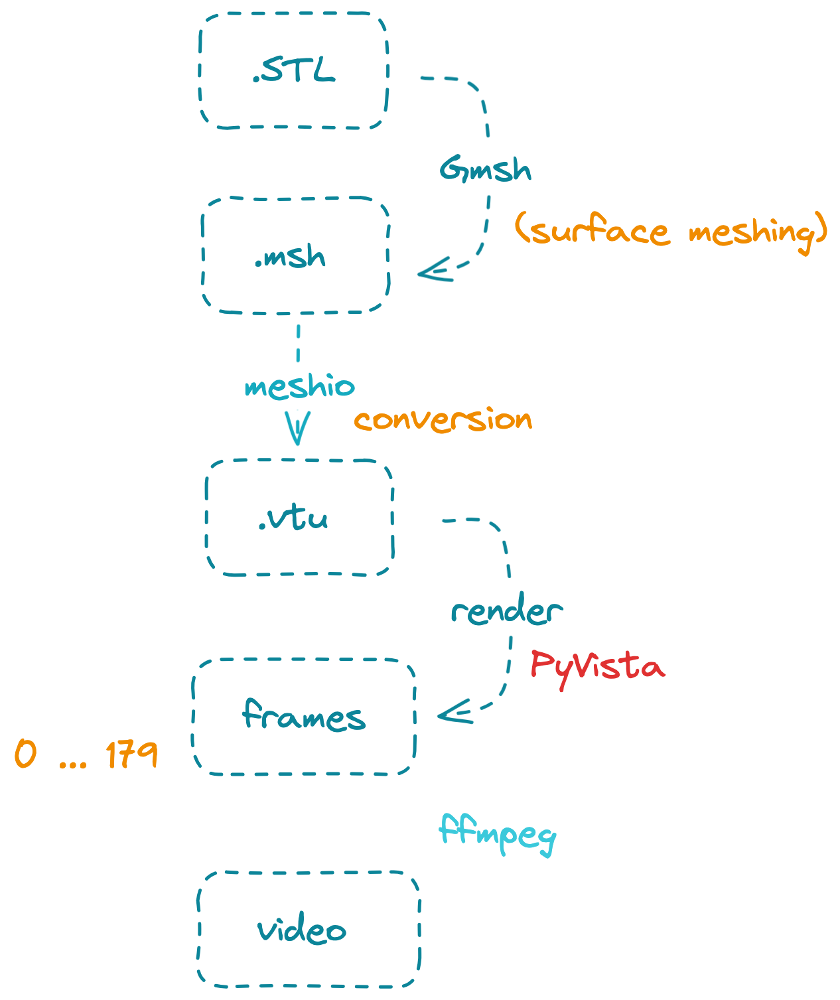

# Stanford Bunny Mesh Rendering Pipeline

This repository demonstrates a complete **mesh-to-video rendering pipeline** using **Gmsh**, **meshio**, **PyVista**, and **FFmpeg**, starting from a raw STL surface and ending with a rotating visualization video.

The goal of this project is to:
- Generate a surface mesh from an STL model
- Convert it into a VTK-compatible format
- Render it off-screen on an HPC environment
- Produce a smooth rotation video from rendered frames

---

## Overview of the Workflow

```
Stanford_Bunny.stl
        ↓
   Gmsh (surface meshing)
        ↓
     bunny.msh
        ↓
  meshio (format cleanup & conversion)
        ↓
     bunny.vtu
        ↓
 PyVista (off-screen rendering)
        ↓
   PNG frame sequence
        ↓
     FFmpeg
        ↓
   bunny_mesh.mov / .mp4
```

Each step exists for a **specific technical reason**, explained below.



---

## Surface Meshing with Gmsh (`mesh_bunny_gmsh.py`)

### Purpose
Convert the raw STL surface into a **clean 2D triangular surface mesh**.

### Key Design Choices
- **Surface-only mesh (2D)**: No volume tetrahedralization
- **Controlled mesh resolution**: Ensures reasonable runtime on HPC

### Code Summary
```python
gmsh.merge("Stanford_Bunny.stl")

angle = 40 * math.pi / 180.0
gmsh.model.mesh.classifySurfaces(angle, True, False, math.pi)

gmsh.option.setNumber("Mesh.CharacteristicLengthMin", 0.01)
gmsh.option.setNumber("Mesh.CharacteristicLengthMax", 0.05)

gmsh.model.mesh.generate(2)
gmsh.write("bunny.msh")
```

---

## Mesh Format Conversion (`convert_msh_to_vtu.py`)

### Why Conversion Is Necessary

- **PyVista / VTK do not natively support `.msh` well**
- Gmsh `.msh` files may contain:
  - `cell_sets`
  - `point_sets`
  - `field_data`

These often cause PyVista to fail or misinterpret the mesh.

### Solution
Use **meshio** as a clean intermediate layer.

### Code Summary
```python
m = meshio.read("bunny.msh")

# Remove metadata that can break PyVista
m.cell_sets = {}
m.point_sets = {}
m.field_data = {}

meshio.write("bunny.vtu", m)
```

### Result
A clean, VTK-compatible `.vtu` file that PyVista can load reliably.

---

## Off-Screen Rendering with PyVista (`render_bunny_frames.py`)

### Environment Constraints
- Running on **HPC / SSH**
- No X server
- No interactive window

### Solution
Use **off-screen rendering** with PyVista + VTK.

```python
pv.OFF_SCREEN = True
pl = pv.Plotter(off_screen=True)
```

---

### Rendering Strategy

Instead of rotating the camera (which is unstable in off-screen mode),  
**the mesh itself is rotated** for each frame.

### Rendering Loop
```python
for i in range(n_frames):
    mesh = mesh0.copy(deep=True)
    mesh.rotate_z(step * i, point=mesh.center, inplace=True)

    pl.remove_actor(actor)
    actor = pl.add_mesh(mesh, ...)

    pl.show(screenshot=fname, auto_close=False)
```

### Why Remove & Re-add the Actor?
VTK actors do not reliably support geometry mutation in off-screen mode.  
Removing and re-adding ensures frame correctness.

---

### Output
- `frames/frame_0000.png`
- `frames/frame_0001.png`
- …
- `frames/frame_0179.png`

Each frame corresponds to a **2-degree rotation**, totaling 360°.

---

## Video Encoding with FFmpeg

### Loading FFmpeg on HPC
```bash
module load ffmpeg
```

### Recommended Encoding (macOS-friendly)

#### ProRes (most stable)
```bash
ffmpeg -y -framerate 30 \
  -i frames/frame_%04d.png \
  -c:v prores_ks -profile:v 3 -pix_fmt yuv422p10le \
  bunny_mesh.mov
```

This avoids color artifacts and plays correctly in QuickTime.

---

## Final Deliverables

- Surface mesh (`bunny.msh`)
- VTK mesh (`bunny.vtu`)
- Frame sequence (`frames/*.png`)
- Rotation video (`bunny_mesh.mov`)
- Fully reproducible pipeline
